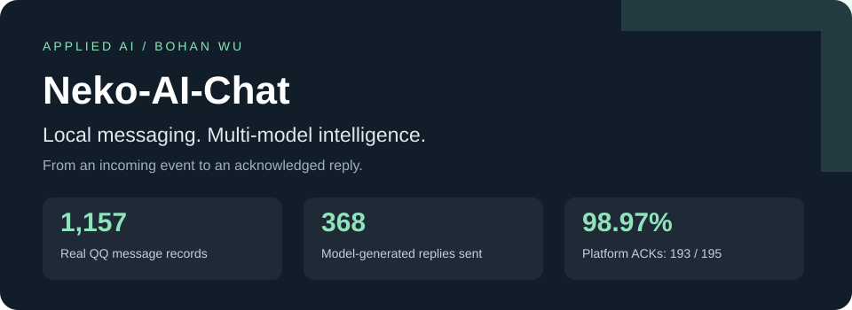
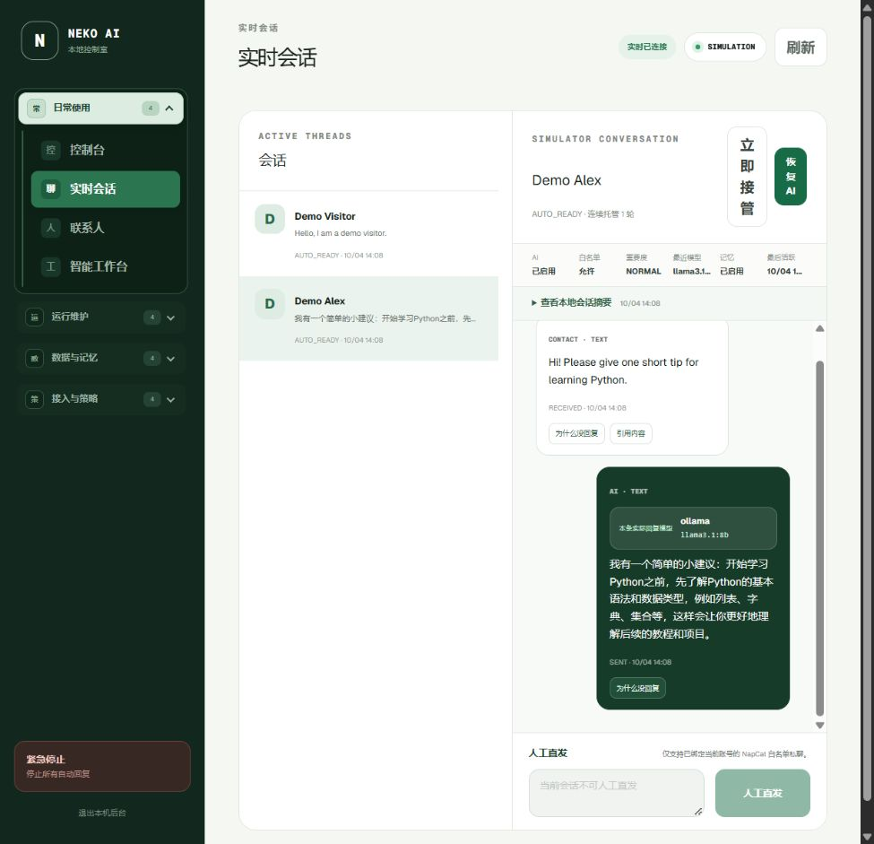
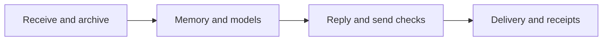
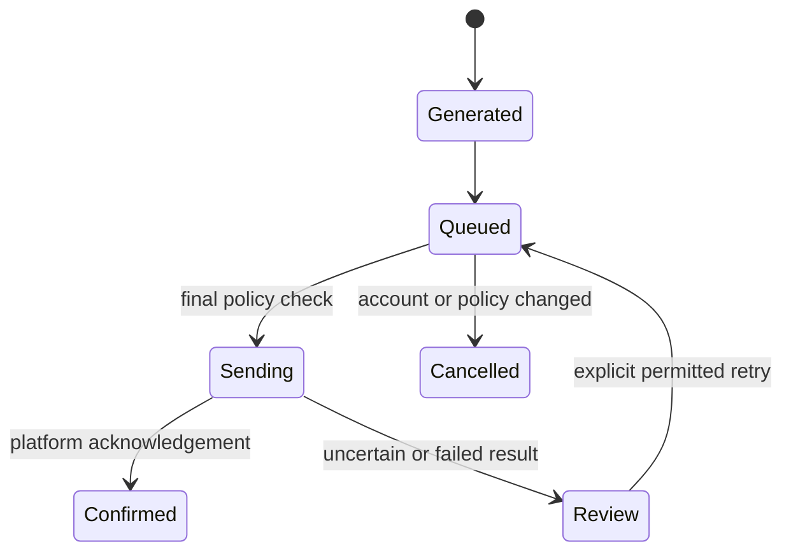

<p align="center"></p>

<p align="center"><b>A local control room for AI-assisted conversations.</b><br>FastAPI · Next.js · SQLAlchemy · Ollama · QQ / NapCat</p>
<p align="center"><a href="README.zh-CN.md">简体中文</a> · <a href="#run-locally">Run locally</a> · <a href="docs/USAGE_REPORT.md">Usage evidence</a> · <a href="spec/README.md">Design specifications</a></p>

Neko connects incoming messages, model selection, contact memory, media understanding, human replies, and delivery tracking in one application. It grew from a personal messaging assistant into a system I used across **35 active calendar days**. The same dashboard explains what was received, which model answered, and whether the platform acknowledged a send.

## In actual use

| Observed result | Evidence |
| :--- | :--- |
| **1,157 QQ message records** | 493 inbound records; 664 outbound records across AI, human, and system authors |
| **368 model-generated replies marked sent** | Kimi, DeepSeek, and two local Ollama models; template messages counted separately |
| **193 / 195 platform-confirmed deliveries — 98.97%** | Unique messages represented in the retained delivery ledger |
| **118 completed media analyses** | 84 images, 29 audio messages, and 5 files |
| **116 duplicate events ignored** | Retained audit events, separate from simulated replay testing |
| **551 automated tests passed** | Backend regression suite; includes a 1,000-event policy and replay test |

The database observation covers **26 Aug–29 Sep 2026, Asia/Shanghai** and was audited on 7 Oct. These are historical usage results, with simulator records excluded. The [usage report](docs/USAGE_REPORT.md) defines each denominator and the available logging coverage.

## A conversation, with an execution trail

<p align="center"></p>

The screenshot uses fictional contacts in simulation mode and a real local Ollama response. It shows the product interface without publishing personal conversations.



## What I designed and built

- **Message lifecycle:** account-scoped event keys, durable inbound processing, a final pre-send check, and a delivery ledger that distinguishes generation, queuing, sending, and acknowledgement.
- **Model orchestration:** local and cloud providers, task-aware routing, timeouts, bounded retries, provider fallback, and visible provider health.
- **Conversation intelligence:** per-contact memory, summaries, image understanding, audio transcription, document context, and administrator-mediated task delegation.
- **Operations UI:** live conversations, manual replies, provider settings, incident review, background tasks, and account switching.

I led the architecture, feature logic, implementation, and practical use. Development followed written specifications, with Codex assisting implementation and iteration in a spec-driven vibe-coding workflow. Design decisions and acceptance criteria are recorded in [spec/](spec/README.md).

## Delivery reliability



Model generation does not itself authorize a send. Account changes, human takeover, allowlists, rate limits, and the stop control are checked before delivery. Uncertain sends are recorded for review so retries do not silently create duplicates.

## Run locally

Requires Python 3.12 and Node.js 22.13+. The default SQLite setup runs on localhost in simulation mode. Install FFmpeg and make it available on PATH for media compression and the full media regression tests.

```bash
git clone https://github.com/CatAlvin/Neko-AI-Chat.git
cd Neko-AI-Chat
python -m venv .venv
# Activate .venv for your shell, then:
python -m pip install -r backend/requirements.txt
cd backend
python -m uvicorn app.main:app --host 127.0.0.1 --port 8000
```

In another terminal:

```bash
cd Neko-AI-Chat/frontend
npm ci
npm run build
npm start
```

Open **http://127.0.0.1:3000** and create your own administrator account on first use. Add an Ollama or cloud provider through the dashboard. An [environment template](.env.example) covers optional MySQL and connector settings. No preconfigured account, database, or model credential is shipped.

Windows PowerShell users can also run `scripts/setup.ps1`, followed by `scripts/start.ps1`; `scripts/stop.ps1` stops the recorded application processes.

## Verify and explore

```bash
cd backend
python -m pytest
```

| Start here | Purpose |
| :--- | :--- |
| [Architecture](docs/ARCHITECTURE.md) | Responsibilities and persistence model |
| [Validation](docs/ACCEPTANCE_V1.md) | Current checks and real-use evidence |
| [Acceptance matrix](docs/ACCEPTANCE_MATRIX_V1.md) | Tests mapped to behavior |
| [Specification index](spec/README.md) | 26 iterations and 18 focused flow diagrams |
| [Administrator commands](docs/ADMIN_COMMANDS.md) | Supported control and delegation commands |

Real-use figures refer to the NapCat QQ connector. QQ official-bot support has a separate acceptance path; the experimental AutoWx adapter produces drafts. NapCat itself is a separate third-party component. See [acknowledgements](THIRD_PARTY.md).

Optional local speech integrations can be installed with `python -m pip install -r backend/requirements-speech.txt`. The core application and regression suite do not require downloading speech models.
