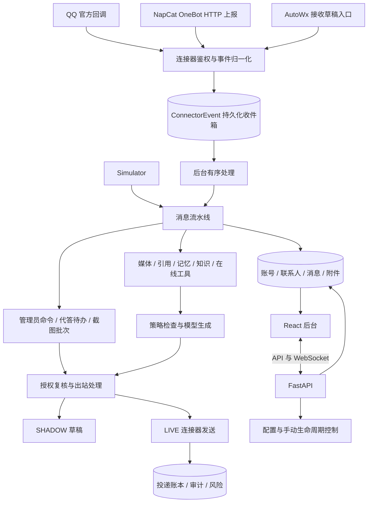

# V1.25.0 · 系统总览

版本号: V1.25.0  
目标: 划分入口、业务处理、持久化与外部执行职责。  

## 运行边界与实现入口

入口收到事件、模型产生文本、平台接受发送是三个独立成功点。后台任务中心不承载所有实时消息，实时入站有单独的持久化收件箱。

实现：`backend/app/main.py`、`backend/app/api/connectors.py`、`backend/app/services/pipeline.py`。
