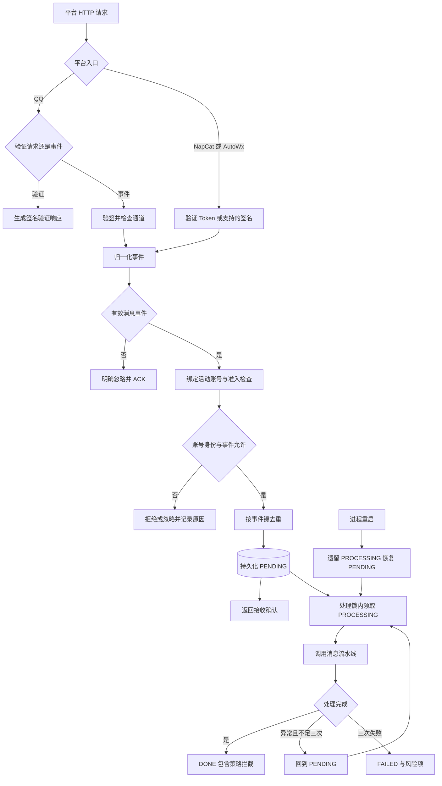

# V1.25.0 · 连接器与入站恢复

版本号: V1.25.0  
目标: 保证鉴权、身份匹配、持久化 ACK 与重复事件处理一致。  

## 运行边界与实现入口

NapCat 的 401 对应鉴权层，409 可表示未启用活动账号；不要把所有失败归因于 Token。ACK 不等待模型完成。恢复重试仍依赖消息级去重，不能跳过防重保护。

实现：`backend/app/api/connectors.py`、`backend/app/main.py`。
