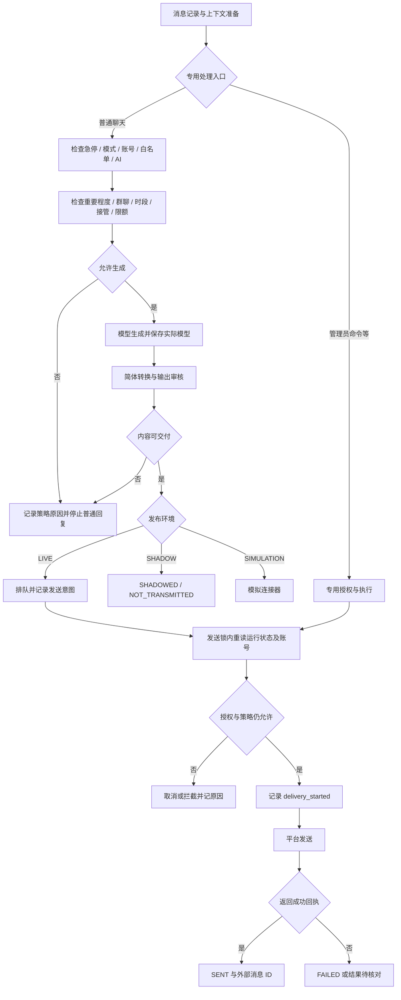

# V1.25.0 · 策略与消息投递

版本号: V1.25.0  
目标: 在生成前与发送前分别复核，呈现草稿、拦截和实际投递。  

## 运行边界与实现入口

图中的普通聊天检查不能替代管理员控制命令的独立语义。SHADOW 不允许任何真实发送；发送超时不等于平台未收到。正式事务可记录待办并给出受限回执，不应静默吞掉询问。

实现：`backend/app/policy/engine.py`、`backend/app/services/pipeline.py`、`backend/app/services/outbox.py`。
