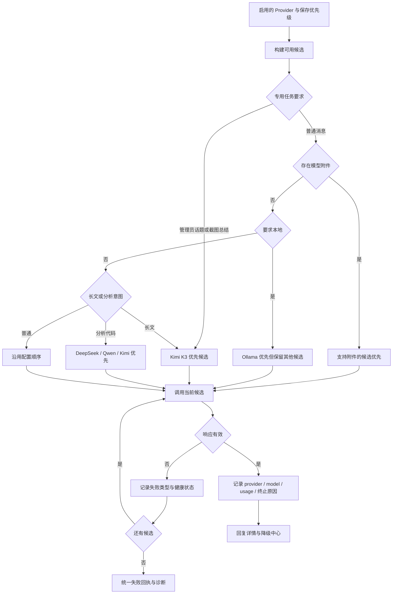

# V1.25.0 · 模型路由与降级

版本号: V1.25.0  
目标: 区分配置优先级、任务路由与本次实际使用模型。  

## 运行边界与实现入口

这里的能力排序来自配置和名称规则，不是自动测评。附件分支先于本地意图；严格离线必须控制候选集和外部工具，不应把“本地优先”显示成“纯本地保证”。生成长文后的续写单独见引用与文档流程。

实现：`model_router.py`、`provider_ordering.py`、`factory.py`、`llm/gateway.py`、`provider_health.py`。服务短路径相对 `backend/app/services/`。
