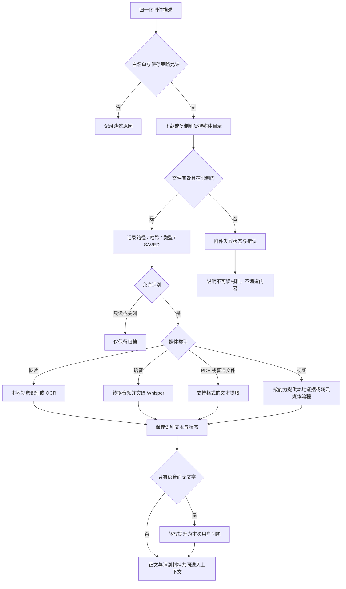

# V1.25.0 · 媒体归档与本地理解

版本号: V1.25.0  
目标: 保留原件并向回复模型提供可追踪的提取结果。  

## 运行边界与实现入口

管理员截图批次可显式开启保存及图片识别，不受普通媒体开关遗漏影响。转写成功不只是数据库里有文本，还须进入实际模型请求。文件不自动执行；白名单不免除大小、路径、格式和来源检查。

实现：`backend/app/services/media.py`、`media_understanding.py`、`pipeline.py`。
