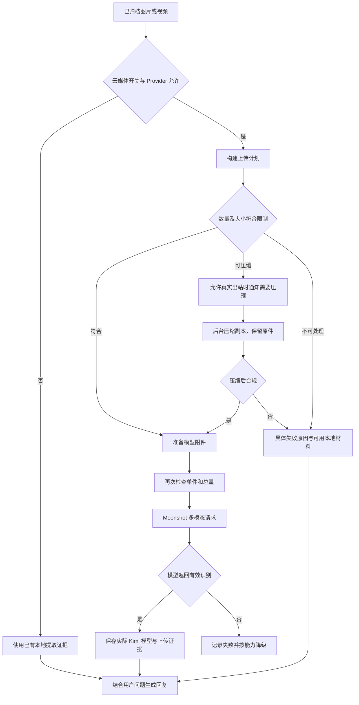

# V1.25.0 · Kimi 媒体上传与压缩

版本号: V1.25.0  
目标: 把真实媒体内容交给支持的模型，并可解释压缩和上传失败。  

## 运行边界与实现入口

最多 8 个附件；有效单件上限取配置与硬上限的较小值，总量仍须检查。文件名、保存成功或 UI 中的 Kimi 标识都不能证明媒体字节已经上传。SHADOW 只记录压缩提示，不向真实联系人发送提示。

实现：`backend/app/services/cloud_media.py`、`backend/app/llm/providers.py`、`backend/tests/test_kimi_media.py`。
