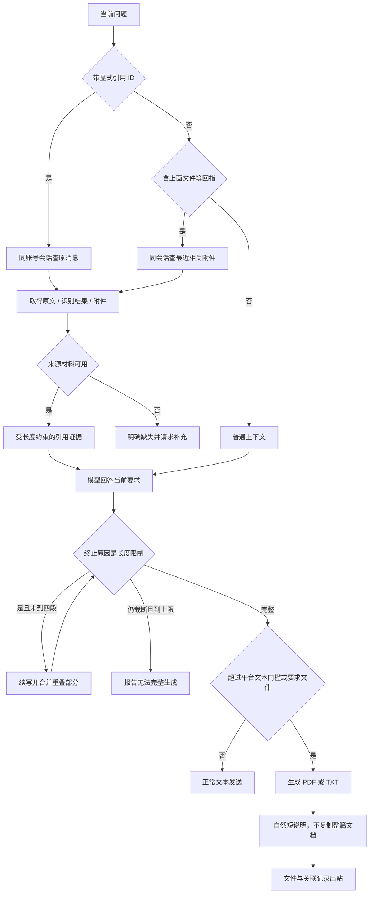

# V1.25.0 · 引用理解与完整文档回复

版本号: V1.25.0  
目标: 锁定引用来源，防止上下文错位和长文截断。  

## 运行边界与实现入口

不把 PDF 原文混入面向联系人的简短说明。引用文本只提供证据，不能借引用内容执行管理员命令。生成文件成功与平台文件发送成功必须分开诊断。

实现：`reference_context.py`、`long_form.py`、`text_overflow.py`、`pipeline.py`，均位于 `backend/app/services/`。
