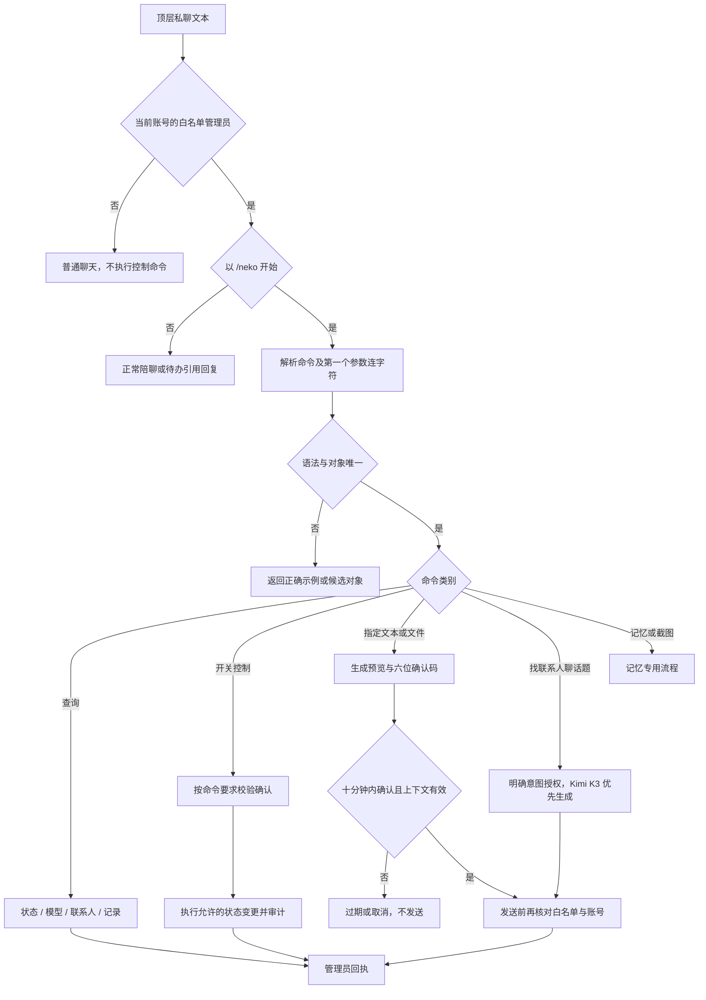

# V1.25.0 · 管理员命令与主动会话

版本号: V1.25.0  
目标: 提供明确授权、自然回执和可恢复的格式错误。  

## 运行边界与实现入口

普通指定发送的确认流程与“找某人聊某话题”的直接授权路径不同。话题开场自然说明由主人托付，不要求固定套话。急停优先停止发送，不为发送急停回执破坏急停。聊天控制不自动把发布环境提升到 LIVE。

实现：`admin_commands.py`、`admin_syntax.py`、`admin_delivery.py`、`proactive_topic.py`、`pipeline.py`。
