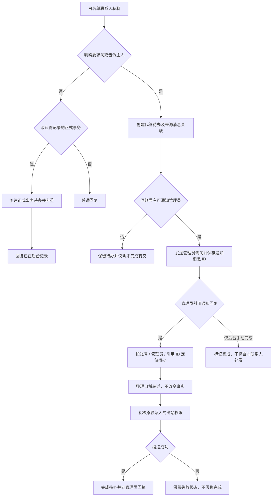

# V1.25.0 · 管理员代答与正式事务

版本号: V1.25.0  
目标: 把明确转交请求变成可追踪待办，而非虚构主人的状态。  

## 运行边界与实现入口

触发依赖明确指向及转交意图，普通谈论“主人”不是转交请求。管理员的引用回复只处理已关联的待办，不能串给另一位联系人。回复失败时待办状态必须与投递结果一致。

实现：`delegated_todo.py`、`formal_matter.py`、`pipeline.py`、`test_online_tools_and_delegated_todos.py`。
