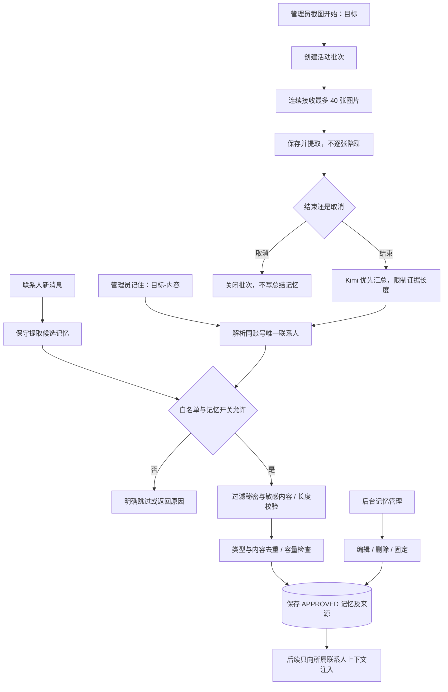

# V1.25.0 · 长期记忆与截图批次

版本号: V1.25.0  
目标: 让记忆直接可用，同时保留来源、隔离和可编辑性。  

## 运行边界与实现入口

普通提取当前采用受限规则，不等价于任意聊天全量摘要。截图最多 30000 字符汇总证据，联系人记忆最多 100 条。自动生效不代表免去内容校验；READ_ONLY 不更新记忆。双账号同步当前采用手动截图，图中没有虚构并发监听入口。

实现：`memory.py`、`admin_memory_import.py`、`prompt.py`。
