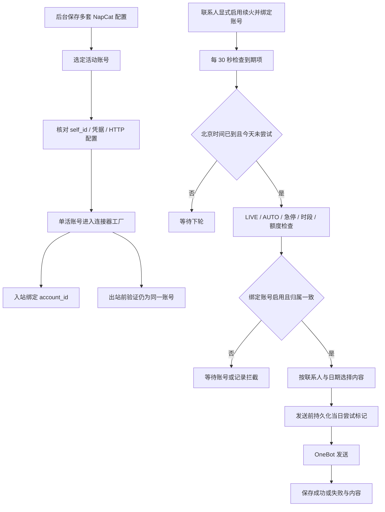

# V1.25.0 · 账号切换与续火

版本号: V1.25.0  
目标: 隔离账号身份与授权，避免切换后错投和重复续火。  

## 运行边界与实现入口

续火是联系人单独授权，可不要求普通聊天白名单，但不是绕过全局急停和额度的通用通道。当日尝试先落库，响应丢失不再自动重发；服务停机或失败时不保证任何连续 24 小时窗口一定有消息。

实现：`account_selection.py`、`keepalive.py`、`factory.py`、`test_keepalive_and_napcat_profiles.py`。
