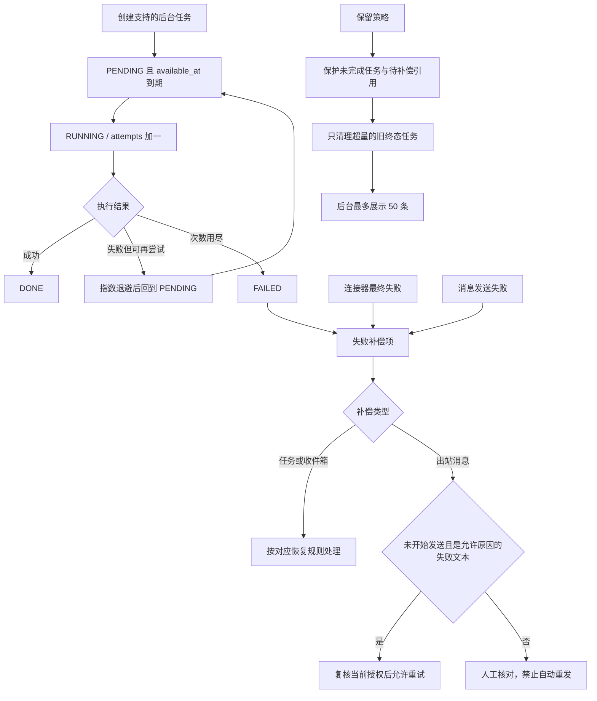

# V1.25.0 · 任务中心与失败补偿

版本号: V1.25.0  
目标: 区分可重试任务和不可盲目重发的聊天投递。  

## 运行边界与实现入口

任务中心当前任务类型为 DAILY_DIGEST、KNOWLEDGE_REFRESH、RECOVERY_SYNC；收件箱与出站不是这三个任务类型。保护任务超过 50 条时数据库可超过 50，不能为凑数删除运行中工作。

实现：`task_center.py`、`outbox.py`、`main.py`、`test_productivity_center.py`、`test_reliability_center.py`。
