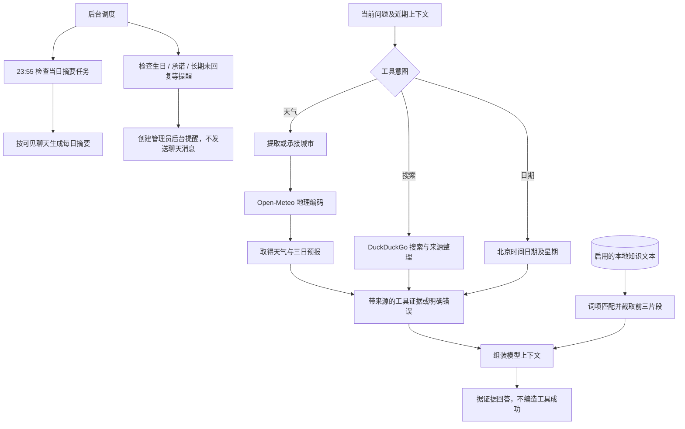

# V1.25.0 · 知识、联网工具、摘要与提醒

版本号: V1.25.0  
目标: 分别处理实时信息、私有知识、日期信息及后台提醒。  

## 运行边界与实现入口

天气或搜索服务失败要保留错误，不以模型常识伪装实时数据。当前日历不等于外部日程同步。知识检索不是向量检索；关系助手当前只生成后台提醒，不向管理员或联系人发送聊天消息，与代答待办通知分开。23:55 调度需要服务运行，并非系统级闹钟。

实现：`online_tools.py`、`knowledge.py`、`daily_digest.py`、`relationship_assistant.py`、`main.py`。
