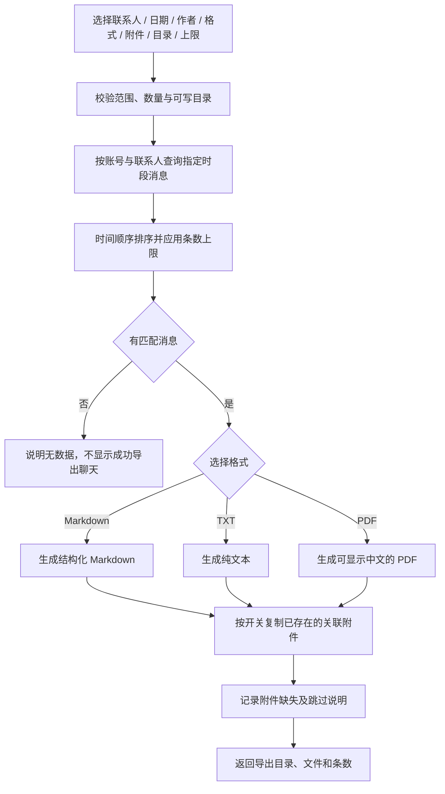

# V1.25.0 · 聊天记录与附件导出

版本号: V1.25.0  
目标: 按明确筛选导出，不改变原始记录和附件。  

## 运行边界与实现入口

默认近 30 天、全部三类作者、Markdown、附带附件、5000 条。SHADOW 草稿标记未发送，导出不能把模型草稿伪装成已发生的对话。文件复制失败应在结果中说明；不要删除或移动聊天原件。

实现：`backend/app/services/chat_export.py`、`backend/app/schemas.py`、`backend/tests/test_chat_export.py`。
