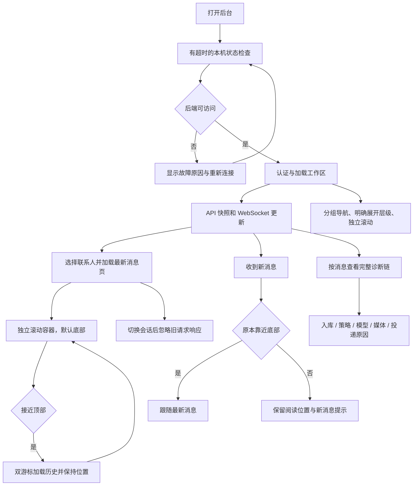

# V1.25.0 · 后台启动、实时会话与诊断

版本号: V1.25.0  
目标: 避免无尽加载、跨联系人串页和新消息撑长整页。  

## 运行边界与实现入口

WebSocket 不是唯一数据源，断线恢复后重新查询。聊天滚动与页面滚动分开；历史加载按 ID 去重。同一模式要覆盖任务、日志、媒体等可持续增长区域。诊断应解释未回复原因，不能用一个 ONLINE 替代全链路结果。

实现：`frontend/app/page.tsx`、`frontend/app/globals.css`、`backend/app/services/observability.py`。
