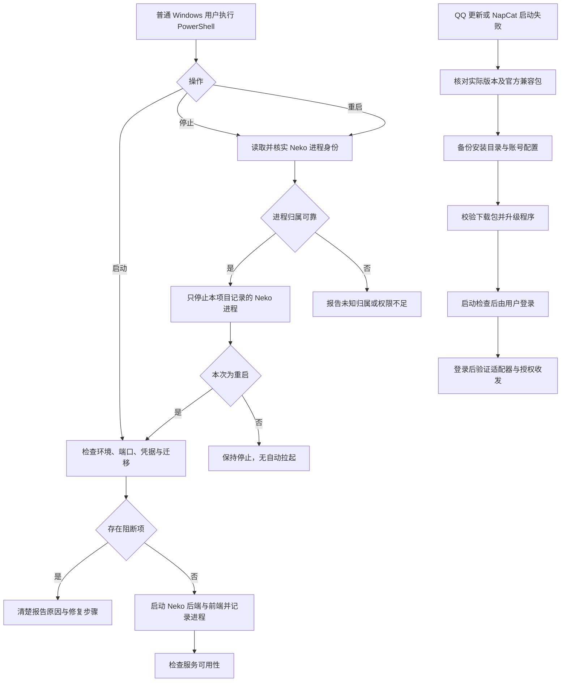

# V1.25.0 · 手动生命周期与兼容维护

版本号: V1.25.0  
目标: 使用同一用户显式启停，不保留自启或崩溃守护。  

## 运行边界与实现入口

不以管理员账户反复重启解决普通用户的归属问题；不误杀 QQ、NapCat、Ollama、MySQL。卸载历史托管仅作用于项目创建的目标，不删除系统通用任务。二维码阶段不能证明 NapCat 登录后的 Packet 和消息收发正常。

实现：`scripts/start.ps1`、`scripts/stop.ps1`、`scripts/restart.ps1`、`scripts/uninstall-startup.ps1`、`backend/app/services/service_control.py`。
