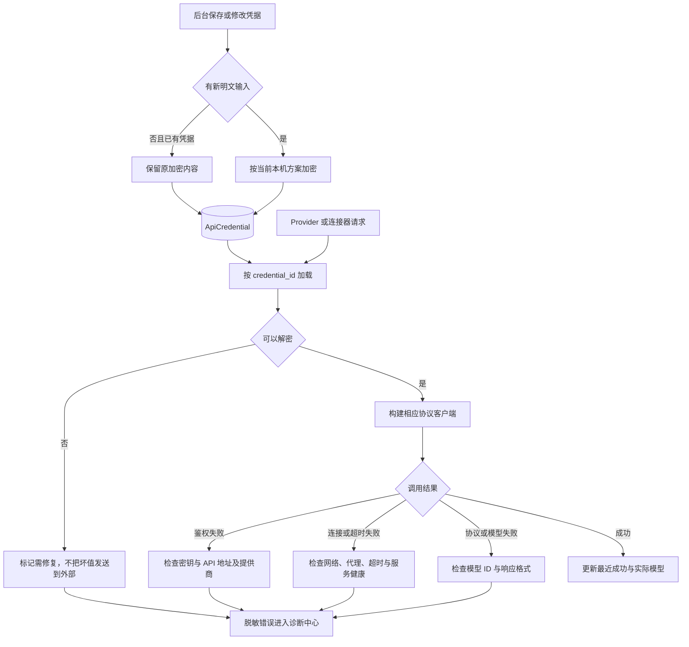

# V1.25.0 · 凭据与连接诊断

版本号: V1.25.0  
目标: 将解密失败、鉴权失败和网络失败分开定位。  

## 运行边界与实现入口

不需要反复重新填写同一 Token 来掩盖缓存、权限、网络或协议故障。错误输出脱敏，修复模式不自动放开 LIVE。修改加密方案需兼容已有数据，保留可恢复的迁移路径。

实现：`backend/app/core/security.py`、`backend/app/services/factory.py`、`provider_health.py`、`configuration_diagnostics.py`。
