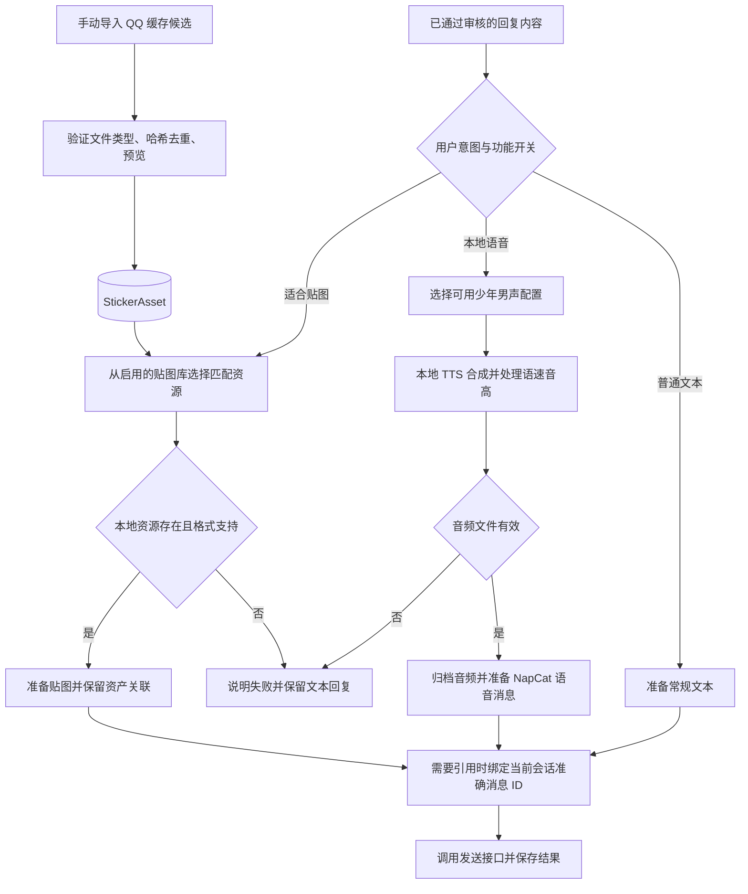

# V1.25.0 · 本地语音、贴图与主动引用

版本号: V1.25.0  
目标: 增强表达形式，同时保持正文、来源与发送结果一致。  

## 运行边界与实现入口

可爱少年音是声音风格要求，不以改变文字人格代替声音质量。语音识别与语音合成是不同模块；Whisper 不负责合成。缓存扫描只导入媒体，不修改 QQ 缓存。媒体失败不能标记成成功发送，也不能因此循环补发。

实现：`backend/app/services/local_tts.py`、`stickers.py`、`pipeline.py`、`backend/tests/test_local_voice_and_sticker_cache.py`。
